### ESP32相关

#### 写在前面

ESP32泛指乐鑫的ESP32芯片，目前包括ESP8266、ESP32、ESP32-H、ESP32-C、ESP32-S、ESP32-P多个系列。

这里使用的ESP32是其中一个的系列，可以使用乐鑫官方提供裸芯片、集成模组、官方开发板进行学习和开发。

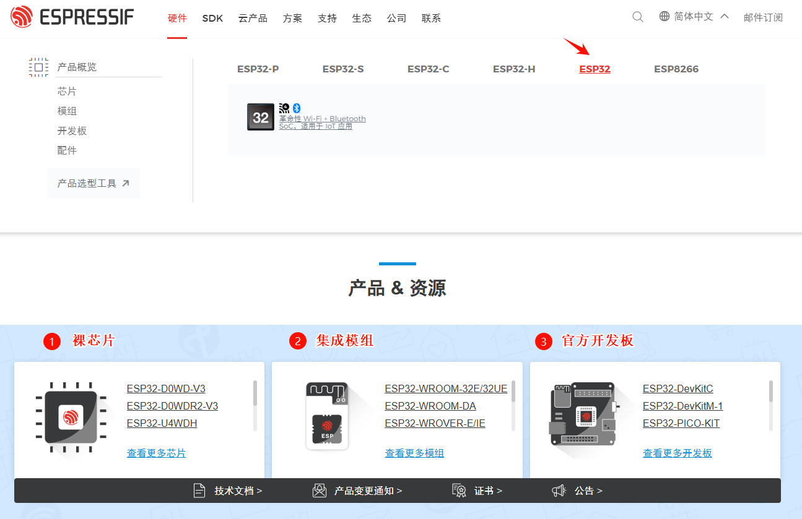

为简化开发过程中的硬件设计，建议选用集成模组进行开发。ESP32的模组型号五花八门，目前官方主推的模组是ESP32-WROOM-32E和ESP32-WROOM-32UE，如下所示，两者的主要区别是天线的连接形式：32E为板载天线，32UE为外接天线。

ESP32-WROOM-32E和ESP32-WROOM-32UE使用的裸芯片为ESP32-D0WD-V3或者ESP32-D0WDR2-V3，集成了外部SPI Flash和必要的外部电路(比如天线)。

> 注意：模组在Flash容量上的区别(4M/8M/16M)，以4M的为常见，其余基本一致。

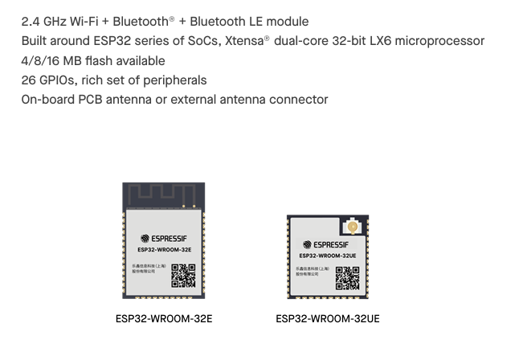

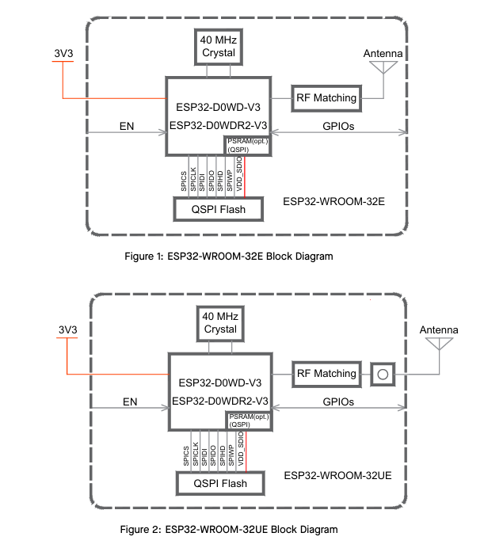

> 我们的开发中使用的是ESP32-WROOM-32E

#### 存储分布和启动流程

##### 片内存储资源

ESP32芯片内部具有以下存储资源

- 448 KB ROM 
- 520 KB SRAM 
- 16 KB SRAM in RTC

##### 外部Flash存储

ESP32芯片需要外扩SPI Flash作为Flash存储设备，用于存储应用程序和其它不同类型的内容，所以需要对进行分区。通过分区操作，可以合理的规划Flash的空间，不同区域存放不同的数据。

##### 分区表

在 Flash 的 默认偏移地址 0x8000 处烧写一张分区表。分区表的长度为 0xC00 个字节，最多可以保存 95 条分区表条目。在分区表之后会附加MD5 校验和数据，用于在运行时验证分区表的完整性。此外，如果芯片使能了安全启动功能，则分区表后还会保存签名信息。

分区表信息可以采用csv文件表示，每个分区表条目包括：Name(标签)、Type(app、data等)、SubType、在Flash中的偏移量、大小、标志Flags。

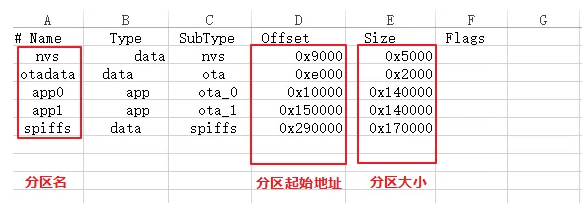

> 烧写到 0x8000处的分区表采用二进制格式，而不是 csv文件本身，可以通过相关工具将csv文件转换成二进制格式。

- Name

  Name字段可以是任何有意义的名称，但不能超过16个字符（超过的内容会被截断）。

- Type

  Type字段可指定为app(0x00)或者data(0x01)，分别表示应用程序和数据

- SubType

  SubType与Type有关。TODO：

- Offset和Size

  TODO：

- Flags

  当前仅支持encrypted标记，表示如果已经启用Flash加密功能，则该分区会被加密。

  > app分区始终会被加密，不管Flags字段是否设置

乐鑫官方提供了很多默认的分区表，一般情况下我们直接使用即可，需要自定义分区的时候再根据实际需求去自定义。

##### Flash存储分布

在Flash的0x1000处固定为bootloader的存放区域，大小为0x7000个字节。

结合分区表，就可以推算出Flash的存储分布，一种Flash的存储分布的示意图如下所示

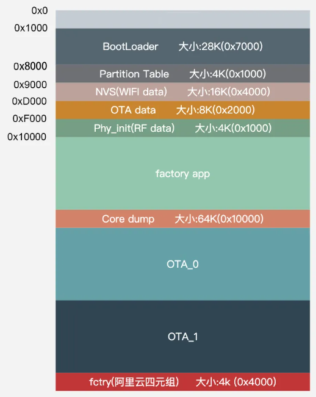

- 0~0x1000 保留
- 0x1000~0x8000 bootloader分区
- 0x8000~0x9000 存放分区表
- 0x9000~0xD000 NVS分区
- 0xD000~0xF000 OTA data分区，系统从哪个app分区启动由这里的数据决定
- 0xF000~0x10000 PHY init分区，用于存储PHY的初始化数据
- 0x10000~    
  - Factory app分区，保存出厂应用程序
  - Core dump分区，查找系统崩溃时的软件错误
  - OTA0/OTA1分区，保存OTA下载固件，交替保存在这两个分区，镜像验证无误后，会更新OTA data分区
  - fctry分区，私有数据分区

#### 引脚和资源分布

##### 引脚分布

ESP32-WROOM-32E模组的引脚图如下所示，相较于裸芯片而言，有些引脚模组没有引出。

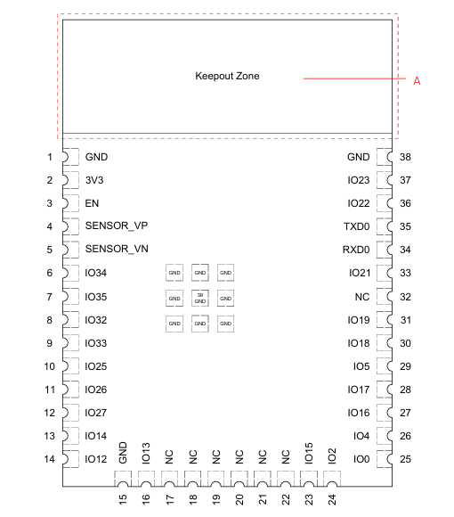

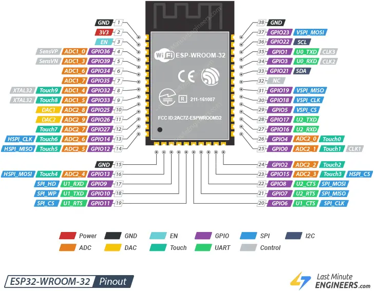

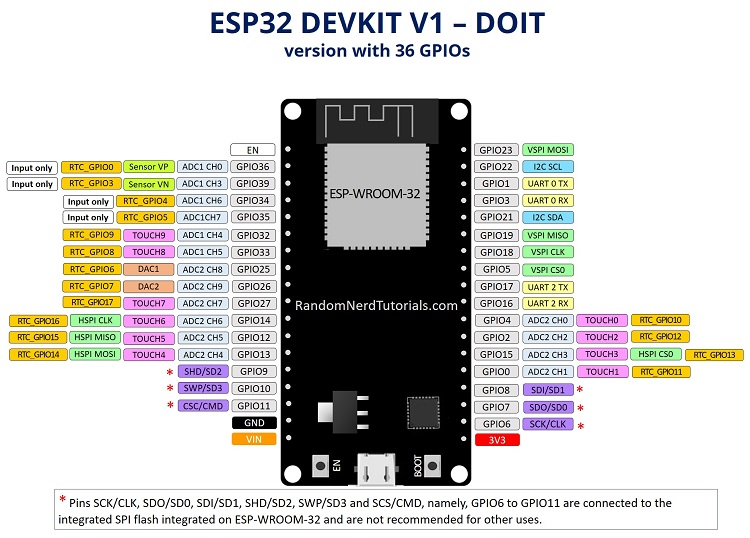

##### 资源分布

ESP32具备以下资源：

- 3个UART

- 3个SPI

  - 一个SPI连接到模组的集成 SPI 闪存，不建议用于其他用途。
    - GPIO 6 (SCK/时钟)
    - GPIO 7 (SDO/SD0)
    - GPIO 8 (SDI/SD1)
    - GPIO 9 (SHD/SD2)
    - GPIO 10 (SWP/SD3)
    - GPIO 11 (CSC/CMD)
  - VSPI
    - MOSI(GPIO23)
    - MISO(GPIO19)
    - SCK(GPIO18)
    - CS(GPIO5)
  - HSPI
    - MOSI(GPIO13)
    - MISO(GPIO12)
    - SCK(GPIO14)
    - CS(GPIO15)

- 2个I2S

- 18路12 bit ADC

  - ADC1_CH0 (GPIO 36)
  - ADC1_CH1 (GPIO 37)
  - ADC1_CH2 (GPIO 38)
  - ADC1_CH3 (GPIO 39)
  - ADC1_CH4 (GPIO 32)
  - ADC1_CH5 (GPIO 33)
  - ADC1_CH6 (GPIO 34)
  - ADC1_CH7 (GPIO 35)
  - ADC2_CH0 (GPIO 4)
  - ADC2_CH1 (GPIO 0)
  - ADC2_CH2 (GPIO 2)
  - ADC2_CH3 (GPIO 15)
  - ADC2_CH4 (GPIO 13)
  - ADC2_CH5 (GPIO 12)
  - ADC2_CH6 (GPIO 14)
  - ADC2_CH7 (GPIO 27)
  - ADC2_CH8 (GPIO 25)
  - ADC2_CH9 (GPIO 26)

  > 注意：使用Wifi时不能使用ADC2

- 2个8 bit DAC

  - DAC1 (GPIO25)
  - DAC2（GPIO26）

- 10个电容式感应GPIO

  - T0 (GPIO 4)
  - T1 (GPIO 0)
  - T2（GPIO 2）
  - T3（GPIO 15）
  - T4（GPIO 13）
  - T5（GPIO 12）
  - T6（GPIO 14）
  - T7（GPIO 27）
  - T8（GPIO 33）
  - T9（GPIO 32）

- 只作为输入的GPIO

  - GPIO 34
  - GPIO 35
  - GPIO 36
  - GPIO 37
  - GPIO 38
  - GPIO 39

- 16个PWM输出通道

  - 任何输出引脚都可以作为PWM输入通道，除了只作为输入的GPIO

- 1个I2C，任何引脚都可以配置为SDA和SCL，默认如下

  - GPIO 21 (SDA)
  - GPIO 22 (SCL)

- 中断

  - 所有的GPIO都可配置为中断

- 启动阶段不建议连接输出的GPIO，这些引脚在启动阶段为特定电平或者输出PWM

  - GPIO 1，UART0调试输出
  - GPIO 3，UART0调试输入，启动时为高
  - GPIO 5，Strapping pin，启动时必须为高
  - GPIO 6 到 GPIO 11（连接到 ESP32 集成 SPI 闪存 – 不建议使用）。
  - GPIO 14，Strapping pin MTDI，启动时必须为低
  - GPIO 15，Strapping pin MTD0，启动时必须为高

- EN管脚

  - EN管脚默认被拉高，是 3.3V 稳压器的启用引脚。所以接地以禁用 3.3V 稳压器，执行复位。

#### 启动配置和流程

##### 启动配置

ESP32具备5个Strapping Pins，如下表所示。

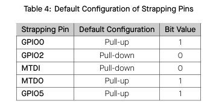

Strapping Pins和eFuse bits 决定了ESP32的启动配置

- 启动模式

  ESP32的启动模式由GPIO0 and GPIO2共同决定。

  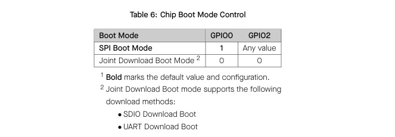

  - GPIO0为1，GPIO2为任意值时，ESP32工作在正常从SPI Flash加载启动的模式。

  - GPIO0和GPIO2均为0，ESP32工作在固件下载模式，可以从串口或者SDIO下载，一般从串口下载。

  - ESP32-WROOM-32E模组的IO0管脚(引脚序号为25)即为GPIO0，IO2管脚(引脚序号为24)。

    > IO2的默认配置为下拉，即为0，所以通过控制IO0即可控制ESP32的工作模式
    >
    > IO0为1为SPI Boot Mode，IO0为0为Download Mode。

- UART0打印输出

  在启动阶段，MTDO控制UART0是否打印输出，默认为使能。

  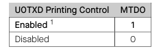

- VDD_SPI的供电电压

  - EFUSE_SDIO_FORCE == 0，由MTDI决定
    - MTDI为0，供电电压为3.3V
    - MTDI为1，供电电压为1.8V
  - EFUSE_SDIO_FORCE == 1，由EFUSE_SDIO_TIEH决定
    - EFUSE_SDIO_TIEH为0，供电电压为1.8V
    - EFUSE_SDIO_TIEH为1，供电电压为3.3V

- SDIO Slave时序控制，由MTDO和GPIO5共同控制

  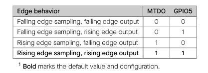

- JTAG Signal Source Control

   EFUSE_DISABLE_JTAG为1，JTAG信号可以被disabled。

##### 启动流程

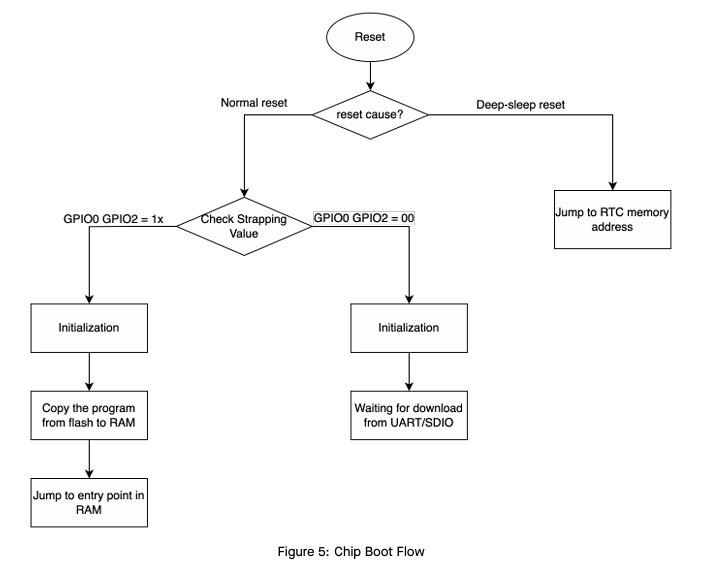

- 一级引导程序

  该程序被固化在了ESP32内部的ROM中，它会从Flash的0x1000偏移地址处引导二级程序至RAM(IRAM&DRAM)中。

- 二级引导程序

  二级引导程序，即为位于Flash的0x1000偏移地址处的bootloader。该程序从Flash中加载分区表和主程序镜像至内存中。

  > 主程序中包含了RAM段和通过Flash高速缓存映射的只读段。

- 应用程序启动阶段

  该阶段，用户程序运行。

### 硬件设计

#### 主控板

##### EP32最小系统

##### 串口通信

##### 防倒灌设计

##### 自动下载设计